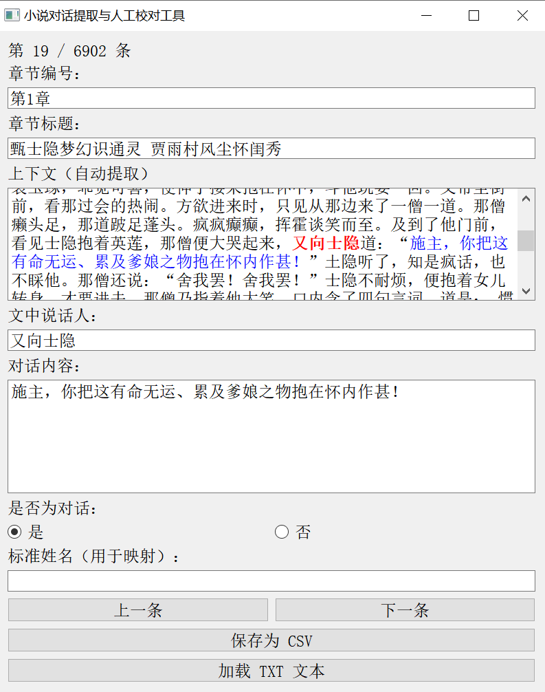

# 小说对话提取与人工校对工具


一个用于从小说文本中提取对话并进行人工校对的图形化工具，支持对话内容高亮显示、说话人标准化映射和CSV导出功能。

## 功能特性

- 📖 **自动对话提取**：从TXT格式小说中智能识别对话内容
- ✏️ **人工校对**：可视化界面方便校对和修正提取结果
- 🔍 **上下文高亮**：说话人(红色)和对话内容(蓝色)高亮显示
- 🏷️ **标准姓名映射**：建立文中说话人与标准姓名的对应关系
- 📊 **CSV导出**：导出对话数据和姓名映射表
- 📂 **章节识别**：支持自定义章节标题识别模式

## 安装使用

### 依赖安装

```bash
pip install PyQt5
```

### 运行程序

```bash
python dialogue_extractor.py
```

## 使用指南

1. **加载文本**：
   - 点击"加载TXT文本"按钮选择小说文件
   - 粘贴章节标题示例帮助程序识别章节格式

2. **校对编辑**：
   - 使用"上一条"/"下一条"按钮导航
   - 修改说话人、对话内容等信息
   - 设置是否为有效对话
   - 输入标准姓名建立映射关系

3. **导出数据**：
   - 点击"保存为CSV"导出对话数据
   - 自动生成姓名映射表

## 数据格式

导出的CSV文件包含以下字段：

| 字段名 | 说明 |
|-------|------|
| 章节编号 | 小说章节编号 |
| 章节标题 | 小说章节标题 |
| 文中说话人 | 原文中的说话人名称 |
| 对话内容 | 对话文本内容 |
| 上下文 | 对话所在上下文(约600字) |
| 是否为对话 | 标记是否为有效对话 |
| 标准姓名 | 标准化的人物姓名 |

## 示例截图



## 开发说明

### 核心算法

对话提取使用正则表达式模式：
```python
r"([\u4e00-\u9fa5]{1,10})[道说曰问应答喊叫嚷骂笑哭叹云言告劝禀叱呵]："(.*?)"
```

章节识别支持自定义模式，默认使用：
```python
r"(第[0123456789]+章)\s+(.+)"
```

### 代码结构

- `DialogueApp`类：主应用程序类
  - `load_txt()`: 加载文本文件
  - `extract_dialogues_with_user_pattern()`: 对话提取核心方法
  - `show_current()`: 显示当前对话(含高亮)
  - `save_csv()`: 导出CSV数据

## 贡献指南

欢迎提交Issue和Pull Request

## 许可证

MIT License
